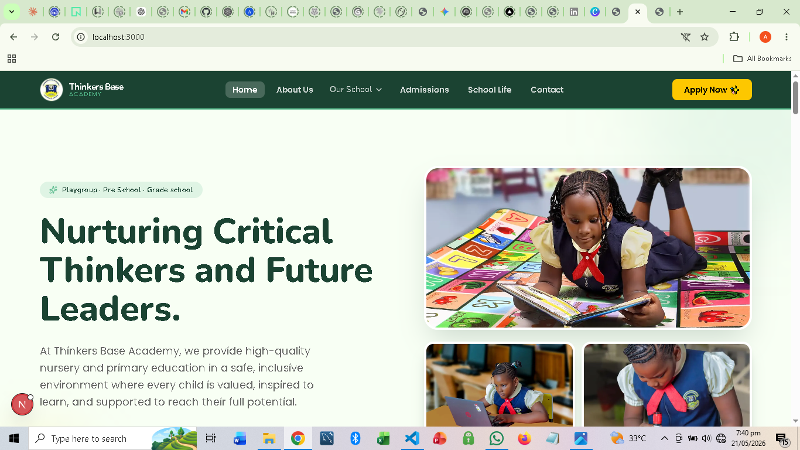

# 🎓 ThinkersBase Academy — School Website with Curriculum Hub Portal

> A full-stack school website built to establish ThinkersBase Academy's online presence — featuring a public-facing school site and a secure internal portal for curriculum management and uploads.

---

## 🔍 Problem Statement

ThinkersBase Academy had no digital presence. Prospective parents and students had no way to find information about the school online, and teaching staff had no centralised system for uploading and managing curriculum materials. Everything was handled informally — through phone calls, printed documents, and physical handouts.

This project delivered two solutions in one: a professional public website for the school, and a secure internal curriculum hub for staff.

---

## 🎯 Project Objectives

- Build a professional, responsive school website to establish online presence
- Showcase the school's programmes, values, staff, and facilities to the public
- Develop a secure internal Curriculum Hub where staff can upload and manage learning materials
- Provide a clean, organised interface for curriculum content by subject and class level

---

## 🛠️ Tech Stack

| Layer | Technology |
|---|---|
| Frontend | HTML5, CSS3, JavaScript |
| Backend | Python (Flask) |
| Database | MySQL |
| Authentication | Flask session-based login |
| File Handling | Flask file upload system |
| Version Control | Git / GitHub |

---

## 🌐 Public Website Features

- **Homepage** — School name, motto, welcome message, and key highlights
- **About Page** — School history, vision, mission, and core values
- **Programmes Page** — List of classes offered, age ranges, and academic focus areas
- **Gallery** — School facilities, events, and student activities
- **Contact Page** — Location, phone, email, and enquiry form
- **Fully responsive** — Works on mobile, tablet, and desktop

---

## 🗂️ Curriculum Hub Portal (Internal)

- **Staff Login** — Secure authentication; only authorised staff can access the hub
- **Dashboard** — Overview of uploaded materials by subject and class level
- **Upload System** — Staff can upload curriculum documents (PDFs, Word files, PowerPoint)
- **Browse by Subject** — Materials organised by subject and term
- **Browse by Class** — Filter content by class level (e.g. JSS1, JSS2, SS1, SS2)
- **Delete/Update** — Staff can manage and replace outdated materials
- **Admin Control** — Admin account can manage staff access

---

## 🗄️ Database Schema

```
staff
├── staff_id (PK)
├── full_name
├── email
├── password_hash
└── role (admin / teacher)

subjects
├── subject_id (PK)
├── subject_name
└── class_level

curriculum_materials
├── material_id (PK)
├── subject_id (FK → subjects)
├── uploaded_by (FK → staff)
├── file_name
├── file_path
├── term
├── class_level
└── upload_date
```

---

## 🔄 Development Process

### Phase 1 — Discovery & Planning
- Met with school management to understand their needs and content structure
- Mapped out the public website pages and the internal portal workflow
- Designed wireframes for both the public site and the curriculum hub dashboard

### Phase 2 — Frontend Development
- Built fully responsive public website with HTML/CSS/JS
- Designed clean, professional school aesthetic with brand colours
- Built the staff portal UI — login page, dashboard, upload form, and content browser

### Phase 3 — Backend Development
- Set up Flask application with route handling for public and portal sections
- Implemented staff authentication with hashed passwords
- Built file upload system with validation (file type and size checks)
- Connected MySQL database for storing file metadata and staff records

### Phase 4 — Testing & Handover
- Tested upload, retrieval, and delete functions across subject/class combinations
- Trained staff on using the curriculum hub
- Documented the admin workflow for managing staff accounts

---

## 📈 Results & Impact

| Metric | Outcome |
|---|---|
| Online presence | School now discoverable online for the first time |
| Curriculum accessibility | All teaching materials in one central location |
| Staff efficiency | No more sharing documents via WhatsApp or physical printouts |
| Parent engagement | Parents can now find school information independently online |

---

## 📸 Screenshots

>
---

## 🚀 How to Run Locally

```bash
# Clone the repository
git clone https://github.com/Yahwehboi/thinkersbase-academy.git

# Navigate to the project folder
cd thinkersbase-academy

# Install dependencies
pip install flask mysql-connector-python werkzeug

# Set up MySQL database
mysql -u root -p < schema.sql

# Configure your database connection in config.py

# Run the app
python app.py
```

Open `http://localhost:5000` in your browser.

**Default admin login:**
- Email: `admin@thinkersbase.com`
- Password: `admin123` *(change immediately in production)*

---

## 👤 Author

**Agboola Anuoluwapo David**
Data Analyst | Web Developer | CS Graduate

- 🌐 Portfolio: [yahwehboi.github.io](https://yahwehboi.github.io)
- 💼 LinkedIn: [linkedin.com/in/anuoluwapo-agboola-b11000195](https://linkedin.com/in/anuoluwapo-agboola-b11000195)
- 📧 agboolaanouluwapo@gmail.com

---

## 📄 License

MIT License — free to use for educational and portfolio purposes.
